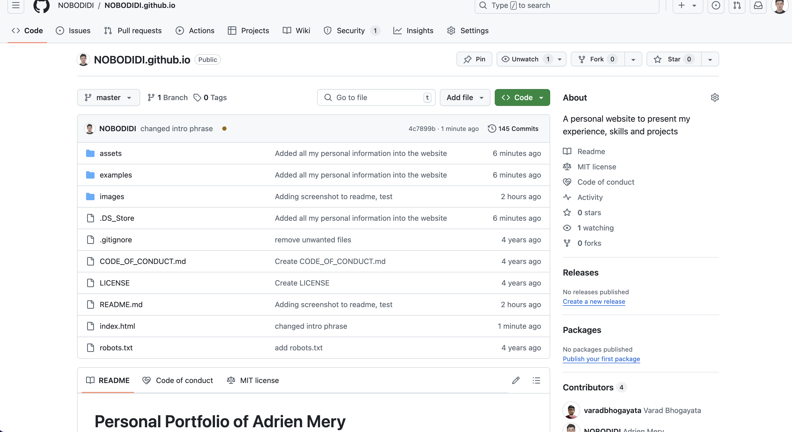
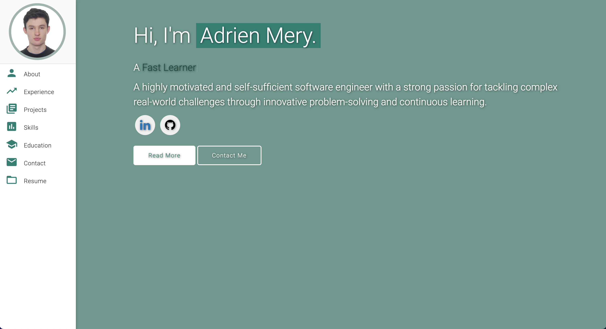
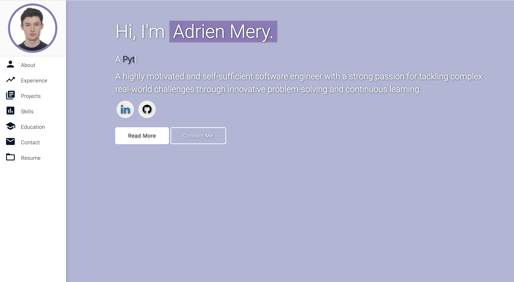
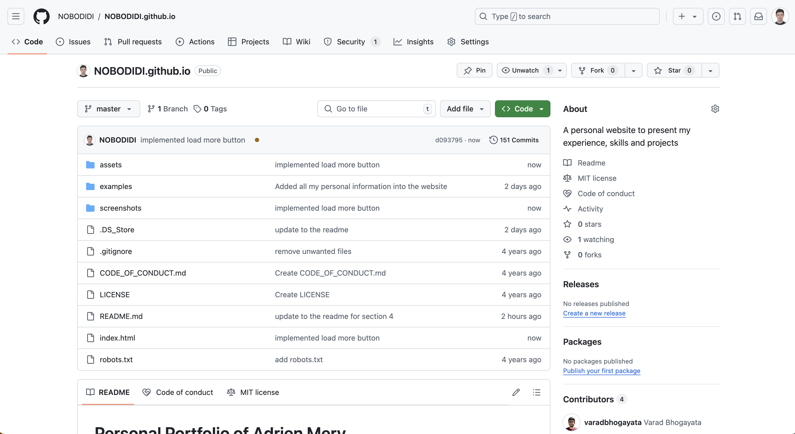

# Personal Portfolio of Adrien Mery

Note: This repo is a clone of
https://github.com/varadbhogayata/varadbhogayata.github.io

## Activity 1

Below is a screenshot of the repository at this stage:

## Activity 2

Below is a screenshot of the repository at this stage:

And here is a preview of the published website's home page:

## Activity 3

Below is a screenshot of the repository at this stage:

And here is a preview of the published website's home page:

## Activity 4

Below is a screenshot of the repository at this stage:

And here is a preview of the published website's Places Travelled section:

## Activity 5

Below is a screenshot of the repository at this stage:

And here is a preview of the published website's at the Recent Projects section:

Here is the website when I click on load more once:

Here is the website when I click on load more again:

